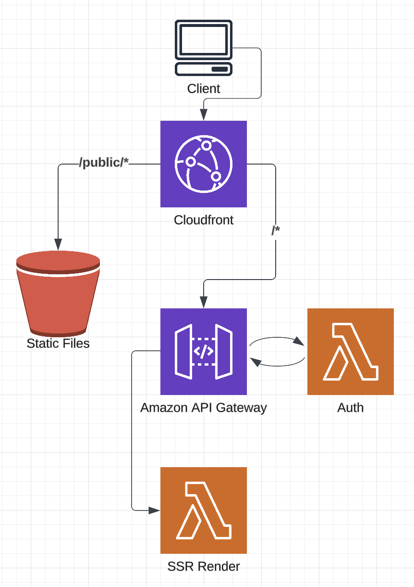

# lambda-ssr-react-app

A ReactJS SSR app hosted in AWS.



## Overview

Render SSR app on the client side via an AWS Lambda function. Commonly used to increase SEO scores. This approach could also abstract back end API interactions away from the client side - think authentication.

Cloudfront is used to host the initial index.html as well as other static assets.

### Inspiration

- https://wittcode.com/blogs/server-side-rendering-react-with-express
- http://expressjs.com/en/starter/static-files.html#serving-static-files-in-express
- https://aws.amazon.com/blogs/compute/building-server-side-rendering-for-react-in-aws-lambda
- https://react.dev/reference/react-dom/server

## Environment Variables

`PORT`: Port to expose app on localhost. Used locally only.

`APP_ENV`: `production` | `local` | `docker` are supported.

`STATIC_SOURCE`: Path for static assets. Local file directory - not used in deployed app.

`PUBLIC_PATH`: Path above assets are accessed with on the client side.

`BASE_PATH`: Defined path wear the SSR app is to be accessed from.

## Run Locally

- Live load changes to `/src` and `/tests`. Runs `/tests` on every change.
- Runs in `docker-compose` using `.env.docker` environmental variables.
- Access via `http://localhost:3001/docker/`

```sh
just run
```

## Debug Locally

- Create `.env` file as per values found in `.env.local`.
- Access via `http://localhost:3001/local/`

```sh
just debug
```

## Deploy

- Run `Deploy Environment` in Github Actions.
  - or cd into `tf/` to deploy manually.

- Required aws permissions below.

```json
[
  "dynamodb:*", 
  "s3:*", 
  "lambda:*", 
  "iam:*",
  "apigateway:*",
  "logs:*"
]
```

## lambda test payload

- Enter the below into the lambda test console to simulate api calls directed to it from the API Gateway.

```json
{
  "httpMethod": "GET",
  "resource": "/about",
  "path": "/about",
  "headers": {
    "Content-Type": "application/json"
  },
  "requestContext": {
    "resourcePath": "/about",
    "httpMethod": "GET",
    "requestId": "c6af9ac6-7b61-11e6-9a41-93e8deadbeef",
    "requestTime": "09/Apr/2015:12:34:56 +0000",
    "path": "/about"
  }
}
```

- The below for the auth lambda.

```json
{
    "version": "2.0",
    "type": "REQUEST",
    "routeArn": "arn:aws:execute-api:eu-west-2:700060376888:8lk68m9h25/dev/GET/",
    "identitySource": [
        "6OkamVASECRETSugrcTwFhFqF"
    ],
    "routeKey": "ANY /{proxy+}",
    "rawPath": "/dev/",
    "rawQueryString": "",
    "headers": {
        "accept-encoding": "gzip",
        "authorization": "6OkamVASECRETSugrcTwFhFqF",
        "content-length": "0",
        "host": "8lk68m9h25.execute-api.eu-west-2.amazonaws.com",
        "priority": "u=0, i",
        "sec-fetch-dest": "document",
        "sec-fetch-mode": "navigate",
        "sec-fetch-site": "cross-site",
        "sec-fetch-user": "?1",
        "upgrade-insecure-requests": "1",
        "user-agent": "Amazon CloudFront",
        "via": "2.0 f9f510ca7ffa469320fb8f68f90942f4.cloudfront.net (CloudFront)",
        "x-amz-cf-id": "mS5hM3w8X7EJh4ovDkASgQI9QHXEU4MnbZk5McRk52ASKdzocW0MJQ==",
        "x-amzn-trace-id": "Root=1-66da0774-32c6e5112c547d2c43efbd3d",
        "x-forwarded-for": "146.198.224.119, 3.172.1.11",
        "x-forwarded-port": "443",
        "x-forwarded-proto": "https"
    },
    "requestContext": {
        "accountId": "700060376888",
        "apiId": "8lk68m9h25",
        "domainName": "8lk68m9h25.execute-api.eu-west-2.amazonaws.com",
        "domainPrefix": "8lk68m9h25",
        "http": {
            "method": "GET",
            "path": "/dev/",
            "protocol": "HTTP/1.1",
            "sourceIp": "146.198.224.119",
            "userAgent": "Amazon CloudFront"
        },
        "requestId": "dpYaOhEVLPEEMEA=",
        "routeKey": "ANY /{proxy+}",
        "stage": "dev",
        "time": "05/Sep/2024:19:33:08 +0000",
        "timeEpoch": 1725564788396
    },
    "pathParameters": {
        "proxy": ""
    }
}
```